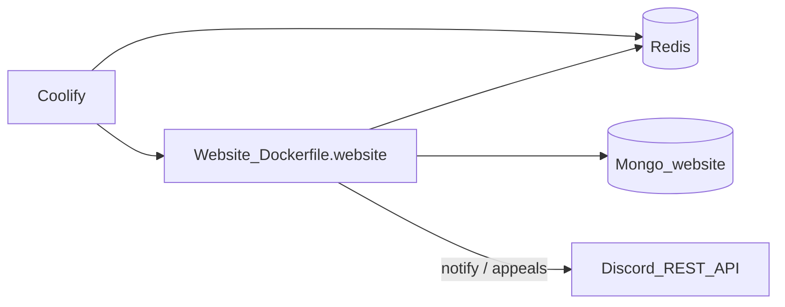

# Coolify setup — website only

This repo deploys **one** application: the public Next.js site. Discord form pings, reminders, and ban appeals run **inside** that process via REST (`packages/discord-notify`). There is **no** gateway bot container here.

The community Discord bot (XP, mod, welcome, …) stays in **`ralevel-discord-bot`** — deploy that separately.



## 1. Redis

Same as before: Coolify Redis on the project network. Internal URL only, e.g. `redis://default:PASSWORD@<redis-service>:6379`.

## 2. Website application

| Setting | Value |
|---------|-------|
| Repo | this git repository |
| Build pack | **Dockerfile** |
| Dockerfile | `/Dockerfile.website` |
| Context | `/` (repo root) |
| Port | **3000** |
| Domain | your public site |

### Build-time env

`MONGODB_URI` + all `NEXT_PUBLIC_*` (Clerk, URL, Stripe, PostHog, Cloudinary, …).

### Runtime env

- `MONGODB_URI`, `CLERK_SECRET_KEY`, `REDIS_URL`, `REDIS_ENABLED=true`
- Stripe / Cloudinary / R2 / Resend / etc. as needed
- Discord (REST — same bot token is fine):

```env
DISCORD_NOTIFICATIONS_ENABLED=true
DISCORD_BOT_TOKEN=...
DISCORD_APPLICATIONS_CHANNEL_ID=...
DISCORD_JR_ADMIN_ROLE_ID=...
DISCORD_SR_ADMIN_ROLE_ID=...
# Ban appeals:
DISCORD_CLIENT_ID=...
DISCORD_CLIENT_SECRET=...
DISCORD_PUBLIC_KEY=...
DISCORD_GUILD_ID=...
DISCORD_BAN_APPEAL_CHANNEL_ID=...
DISCORD_APPEAL_REVIEWER_ROLE_IDS=...
CRON_SECRET=...
```

Form reminders cron (hits the **website**):

```bash
# 6:00 AM IST = 00:30 UTC
curl -fsS -H "Authorization: Bearer $CRON_SECRET" \
  "https://ralevel.com/api/cron/form-reminders"
```

## 3. Do not deploy Dockerfile.bot from this repo

That file was removed. Gateway bot Coolify app should point at the **`ralevel-discord-bot`** repository, not this one.

## Local

```bash
pnpm install
pnpm dev:website
```

Env file: `apps/website/.env.local`
