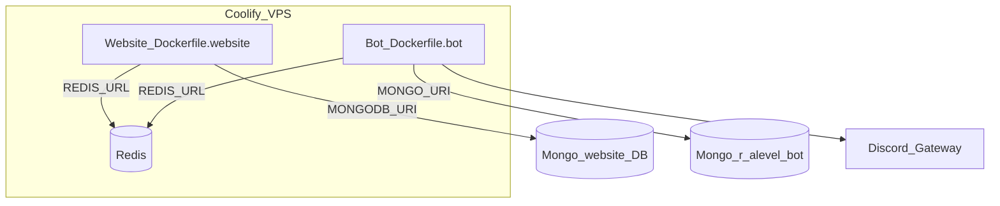

# Coolify setup — website + Discord bot

One git repo, **two** Coolify applications, **one** shared Redis. Restarting the bot does not rebuild the website.



---

## 0. Prerequisites

- Coolify on your VPS with Docker
- This git repo connected to Coolify
- MongoDB Atlas (or equivalent) with:
  - Website DB → `MONGODB_URI`
  - Bot DB → `MONGO_URI` (usually `.../r_alevel_bot`)
- Atlas **Network Access** allows your VPS public IP
- Discord application: bot token, client ID, guild ID, privileged intents enabled

---

## 1. Redis (you may already have this)

1. In Coolify, open your **project**.
2. Add a **Redis** service (`redis:7-alpine` or Coolify’s Redis template).
3. Deploy it.
4. Copy the **internal** URL (same Docker network as your apps), e.g.:

```text
redis://default:YOUR_PASSWORD@<redis-service-name>:6379
```

**Do not** use `localhost` or a public Redis URL from inside app containers.

You will paste this same `REDIS_URL` into **both** Website and Bot env vars.

---

## 2. Website application

### Create / update the app

| Setting | Value |
|---------|-------|
| Source | This git repository |
| Build pack | **Dockerfile** |
| Dockerfile location | `/Dockerfile.website` |
| Base directory / context | `/` (repo root) |
| Port | **3000** |
| Domain | your public domain (e.g. `ralevel.com`) |
| Health check | `/` — start period ~60s |

If you previously used `/Dockerfile`, change it to `/Dockerfile.website`.

### Build-time variables (Coolify Build Variables)

These are baked into the Next client bundle / needed during `next build`:

| Variable | Notes |
|----------|-------|
| `MONGODB_URI` | Required at build for SSG routes |
| `NEXT_PUBLIC_CLERK_PUBLISHABLE_KEY` | |
| `NEXT_PUBLIC_CLERK_SIGN_IN_URL` | e.g. `/sign-in` |
| `NEXT_PUBLIC_CLERK_SIGN_UP_URL` | e.g. `/sign-up` |
| `NEXT_PUBLIC_CLERK_SIGN_IN_FALLBACK_REDIRECT_URL` | e.g. `/` |
| `NEXT_PUBLIC_CLERK_SIGN_UP_FALLBACK_REDIRECT_URL` | e.g. `/` |
| `NEXT_PUBLIC_CLOUDINARY_CLOUD_NAME` | if using Cloudinary |
| `NEXT_PUBLIC_POSTHOG_PROJECT_TOKEN` | if using PostHog |
| `NEXT_PUBLIC_POSTHOG_HOST` | e.g. `https://eu.posthog.com` |
| `NEXT_PUBLIC_STRIPE_PUBLISHABLE_KEY` | if using Stripe |
| `NEXT_PUBLIC_URL` | e.g. `https://ralevel.com` |

### Runtime variables

| Variable | Notes |
|----------|-------|
| `NODE_ENV` | `production` |
| `MONGODB_URI` | Same as build (not baked into final image secrets) |
| `CLERK_SECRET_KEY` | |
| `REDIS_URL` | Internal Coolify Redis URL |
| `REDIS_ENABLED` | `true` |
| `NEXTAUTH_URL` | Public URL (Stripe redirects etc.) |
| Stripe / Cloudinary / R2 / Resend / etc. | Same as before |
| `DISCORD_NOTIFICATIONS_ENABLED` | `true` to enable form channel posts |
| `DISCORD_BOT_TOKEN` | Same Discord bot token is fine |
| `DISCORD_APPLICATIONS_CHANNEL_ID` | Form notify channel |
| `DISCORD_*` appeal vars | If using ban appeals |
| `CRON_SECRET` | For form-reminder cron |

Website form/appeal Discord posts run **inside** the website container (REST). They do **not** need the gateway bot container to be up.

### Deploy website

Deploy. Confirm `https://your-domain/` returns 200 and Clerk sign-in works.

---

## 3. Bot application (separate Coolify app)

### Create a second application in the same project

| Setting | Value |
|---------|-------|
| Source | **Same** git repository |
| Build pack | **Dockerfile** |
| Dockerfile location | `/Dockerfile.bot` |
| Base directory / context | `/` (repo root) |
| Public port / domain | **None** (no public HTTP needed) |
| Restart policy | **Always** / unless-stopped |

Put Website and Bot on the **same Docker network** as Redis (Coolify project network usually does this automatically).

### Runtime variables (bot)

Minimum:

```env
TOKEN=<discord bot token>
CLIENT_ID=<discord application id>
GUILD_ID=<your discord server id>
MONGO_URI=mongodb+srv://...@.../r_alevel_bot?retryWrites=true&w=majority
REDIS_URL=redis://default:PASSWORD@<redis-service-name>:6379
NODE_ENV=production
```

Also copy channel/role seed vars from [`.env.bot.example`](../.env.bot.example) if this is a fresh GuildConfig seed. After the bot has run once, live config lives in Mongo `GuildConfig`.

Optional health / internal sync port (not required):

```env
SYNC_HTTP_PORT=8787
INTERNAL_SYNC_SECRET=<long-random>
```

Only if set: `GET http://<bot-internal-host>:8787/health` works on the private network. Do **not** publish `8787` publicly.

### Deploy bot

1. Deploy the bot app.
2. Check Coolify logs for Mongo connected + Discord login (ready).
3. Register slash commands (one-shot after first deploy or when commands change):

```bash
# From a machine with bot env vars, or a Coolify one-off exec:
node apps/bot/scripts/deploy-commands.js
```

Requires `TOKEN`, `CLIENT_ID`, `GUILD_ID`.

### Verify independent restart

1. In Coolify, **Restart** only the Bot app → Discord comes back; website stays up.
2. Redeploy Website → bot stays connected.

---

## 4. Mongo & Redis summary

| Service | Env var | Who uses it |
|---------|---------|-------------|
| Website Mongo | `MONGODB_URI` | Website only |
| Bot Mongo | `MONGO_URI` | Bot only |
| Redis (shared) | `REDIS_URL` | Website (`cache:*`, `rl:*`) + Bot (`xp:*`) |

Do not point both apps at the same mongoose models/package. Different DBs (or at least different URI DB names) are expected.

---

## 5. Cron (website)

Form reminders still hit the **website**:

```bash
# 6:00 AM IST = 00:30 UTC
curl -fsS -H "Authorization: Bearer $CRON_SECRET" \
  "https://ralevel.com/api/cron/form-reminders"
```

Schedule that in Coolify cron or host cron against the website URL.

---

## 6. Local development

```bash
docker compose up -d redis
pnpm install

# apps/website/.env.local  → website (MONGODB_URI, Clerk, …)
# repo-root .env           → bot (copy from .env.bot.example)

pnpm dev:website
pnpm dev:bot
```

---

## Troubleshooting

| Symptom | Fix |
|---------|-----|
| Bot exits immediately | Missing `REDIS_URL` or `TOKEN` / `MONGO_URI` |
| Bot Redis errors | Using `localhost` instead of Coolify Redis hostname |
| Website build fails on SSG | Missing `MONGODB_URI` in **build** variables; Atlas IP allowlist |
| Website Clerk broken in browser | Missing `NEXT_PUBLIC_*` at **build** time |
| Restarting website fixes Discord | Bot is still coupled somehow — confirm Bot is its own Coolify app with `/Dockerfile.bot` |
